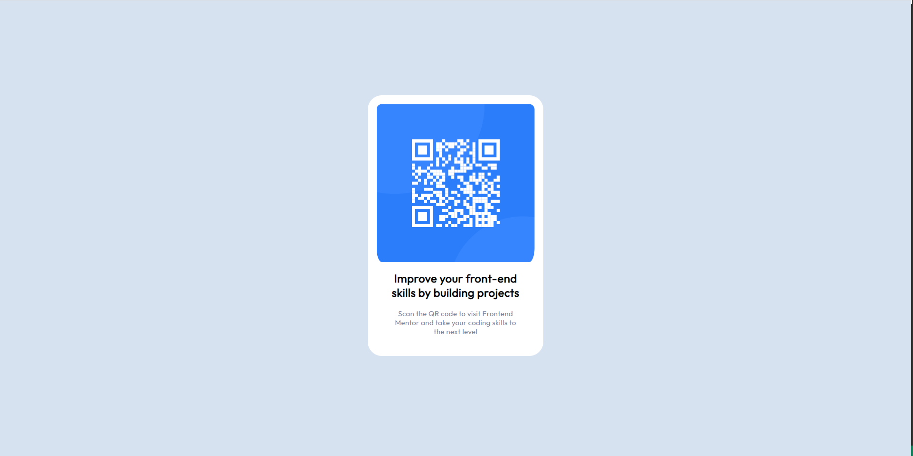

# Frontend Mentor - QR code component solution

This is a solution to the [QR code component challenge on Frontend Mentor](https://www.frontendmentor.io/challenges/qr-code-component-iux_sIO_H). Frontend Mentor challenges help you improve your coding skills by building realistic projects. 

## Table of contents

- [Overview](#overview)
  - [Screenshot](#screenshot)
  - [Links](#links)
- [My process](#my-process)
  - [Built with](#built-with)
  - [What I learned](#what-i-learned)
  - [Continued development](#continued-development)
- [Author](#author)
- [Acknowledgments](#acknowledgments)

## Overview

### Screenshot

### Links

- Solution URL: [Add solution URL here](https://your-solution-url.com)
- Live Site URL: [Add live site URL here](https://your-live-site-url.com)

## My process

### Built with

- Semantic HTML5 markup
- CSS custom properties

### What I learned

I used the lette rspacing style for the efirst time, it definitely made the site look better. I also got a bit better at structuring the html first before diving into the css, I think this made my workflow a bit faster and my code much cleaner, I will try to continue this in the future.

### Continued development

I would like to improve my overall know-how when adding images into a website, I do have the general jist of it, as this is not my first project although it is the first I have uploaded, but I honestly still get a little frightened and/or confused when it get's to that part. i also want to get a bit better at sussing out exactly which display type should be used for an element, if it is needed. I did not have to use the display style in this project, but it is something that I would like to work on.

### Useful resources

## Author

- Frontend Mentor - [@yourusername](https://www.frontendmentor.io/profile/Kena-Njonge)

## Acknowledgments

I would  like to thank the folks at Mozilla (https://developer.mozilla.org/en-US/) and W3schools (https://www.w3schools.com/) for their great resources for aspiring developers.

